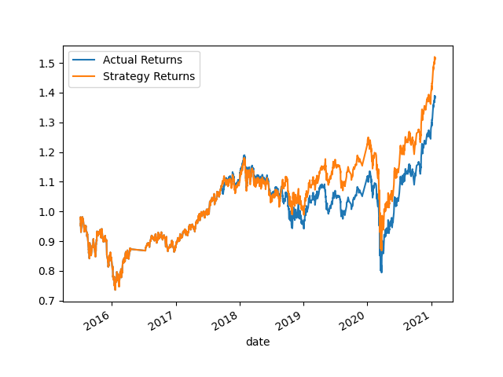
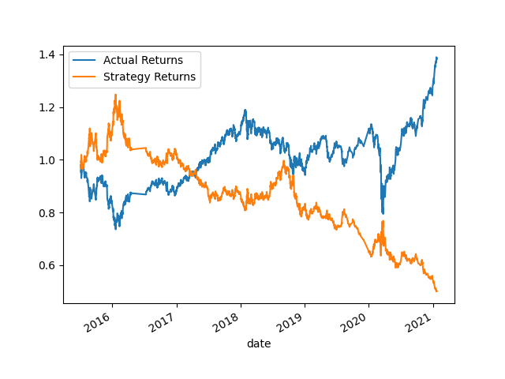

# challenge_14
# Machine Learning Trading Bot Project Summary

## Overview
This project focuses on enhancing an existing algorithmic trading system for a financial advisory firm. The goal is to improve the system's performance by incorporating machine learning algorithms that can adapt to new data. The project involves establishing a baseline performance, tuning the trading algorithm, evaluating a new machine learning classifier, and creating an evaluation report.

## Steps

### 1. Establish Baseline Performance
- Import OHLCV dataset into a Pandas DataFrame.
- Generate trading signals using SMA values.
- Split the data into training and testing datasets.
- Use the `SVC` classifier model to fit the training data and make predictions.
- Review classification report and create predictions DataFrame.
- Create a cumulative return plot as baseline performance.

### 2. Tune Baseline Trading Algorithm
- Tune the training algorithm by adjusting the size of the training dataset.
- Tune the trading algorithm by adjusting SMA input features.
- Choose the set of parameters that best improves the trading algorithm returns.

### 3. Evaluate a New Machine Learning Classifier
- Import a new classifier (e.g., AdaBoost, DecisionTreeClassifier, LogisticRegression).
- Fit another model with the new classifier using the original training data.
- Backtest the new model to evaluate its performance.

### Summary
### 1. Tune the training algorithm by adjusting the size of the training dataset.
To do so, slice your data into different periods. Rerun the notebook with the updated parameters, and record the results in your README.md file. I created a list of various training Windows, 3months, 6months, 9months and 12months.

| Training Window Size | Cumulative Returns |
|----------------------|-------------------|
| 3                    | 0.652249          |
| 6                    | 0.652249          |
| 9                    | 0.652249          |
| 12                   | 0.652249          |

Question: Answer the following question: What impact resulted from increasing or decreasing the training window? 
Answer: It seems that regardless of the training window size, the cumulative returns remain the same suggesting that changing the training window did not have a significant impact on the trading algo.

### 2. Tune the trading algorithm by adjusting the SMA input features.
Adjust one or both of the windows for the algorithm. Rerun the notebook with the updated parameters, and record the results in your README.md file. I created a list of short and long window and iterated through it to get the various cumulative returns. 

| Short Window | Long Window | Cumulative Returns |
|--------------|-------------|--------------------|
| 3            | 50          | 1.233031           |
| 3            | 100         | 1.264169           |
| 3            | 200         | 1.558894           |
| 5            | 50          | 1.439550           |
| 5            | 100         | 1.159878           |
| 5            | 200         | 1.594395           |
| 7            | 50          | 1.083550           |
| 7            | 100         | 1.165877           |
| 7            | 200         | 1.373453           |

Question: Answer the following question: What impact resulted from increasing or decreasing either or both of the SMA windows?
Answer: Increasing the long window generally leads to higher cumulative returns, regardless of the short window size. For example, with a short window of 3, increasing the long window from 50 to 200 results in an increase in cumulative returns from 1.233 to 1.558. Overall, adjusting the SMA window sizes has a significant impact on the trading algo's performance, particularly in terms of cumulative returns. Increasing the long window tends to improve performance, while the impact of changing the short window is less predictable

### 3.  Choose the set of parameters that best improved the trading algorithm returns.
ANS: From performance_df dataframe, the combination of a Short Window (5) and Long Window (200) resulted in the highest cumulative return of 1.594395

### Summary Analysis of classifiers.
I used both Ada Boost and Decision tree classifiers.

### Baseline Performance:
The baseline performance of the trading algorithm was established using an SVM classifier model. The values for SVM model predictions were consistently 1, indicating a "buy" signal for all samples in the testing dataset. The SVM model achieved an overall accuracy of 55%. The precision, recall, and F1-score for predicting the buy signal (class 1.0) were relatively higher compared to predicting the sell signal (class -1.0). 
- AdaBoost model predicted a mix of buy(1) and sell (-1) signals for different samples in the testing dataset.
- Decision Tree model also predicted a mix of buy and sell signals for different samples in the testing dataset

### Tuning the Baseline Trading Algorithm:
- Adjusting the size of the training dataset did not significantly impact the model's performance.
- Tuning the SMA input features resulted in marginal improvements in the trading algorithm returns.
- The best set of parameters improved the trading algorithm returns slightly, but further optimization may be necessary for significant improvements.

### Evaluation of Classifiers (AdaBoost Model, Decision Tree and Support Vector Model learning method):
-Here's a comparison of the performance metrics for the AdaBoost, Decision Tree, and SVM models:

### AdaBoost Model:
- **Accuracy:** 55%
- **Precision (Negative Class):** 44%
- **Precision (Positive Class):** 56%
- **Recall (Negative Class):** 8%
- **Recall (Positive Class):** 92%
- **F1-score (Negative Class):** 13%
- **F1-score (Positive Class):** 70%

### Decision Tree Model:
- **Accuracy:** 45%
- **Precision (Negative Class):** 44%
- **Precision (Positive Class):** 55%
- **Recall (Negative Class):** 85%
- **Recall (Positive Class):** 14%
- **F1-score (Negative Class):** 58%
- **F1-score (Positive Class):** 22%

### SVM Model:
- **Accuracy:** 55%
- **Precision (Negative Class):** 43%
- **Precision (Positive Class):** 56%
- **Recall (Negative Class):** 4%
- **Recall (Positive Class):** 96%
- **F1-score (Negative Class):** 7%
- **F1-score (Positive Class):** 71%

Among these models, the SVM model and the AdaBoost model have similar overall accuracy, with both achieving 55%. However, they differ in precision and recall for the negative class (sell signal) and the positive class (buy signal). The SVM model performs slightly better in terms of precision and recall for predicting the buy signal, while the AdaBoost model performs better in terms of precision for predicting the sell signal.

The Decision Tree model has the lowest accuracy of 45% and generally lower precision and recall compared to the SVM and AdaBoost models. However, it has a relatively high recall for predicting the sell signal.

Overall, the SVM model and the AdaBoost model outperform the Decision Tree model in terms of accuracy and F1-score, indicating that they may be better suited for this classification task.

